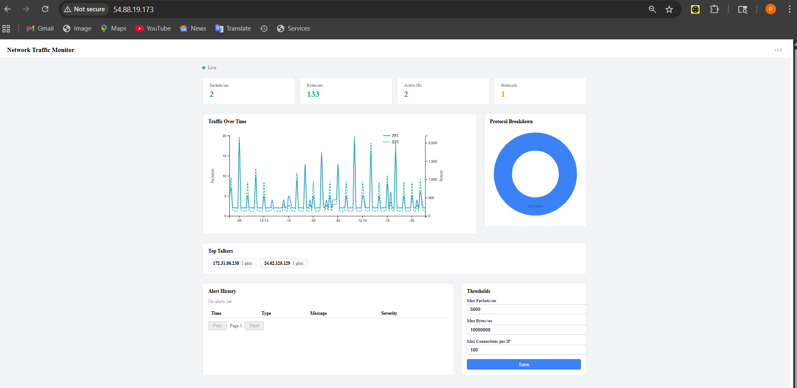
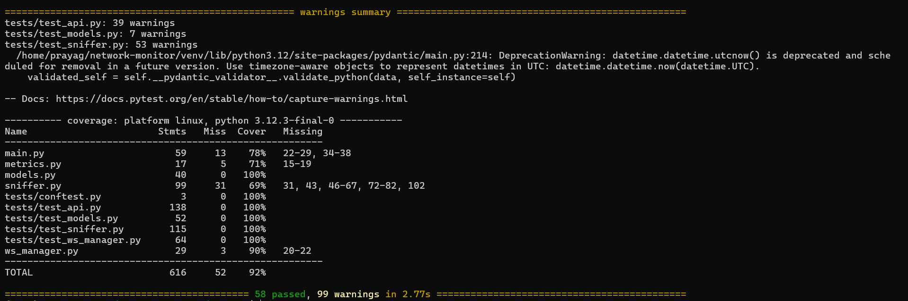
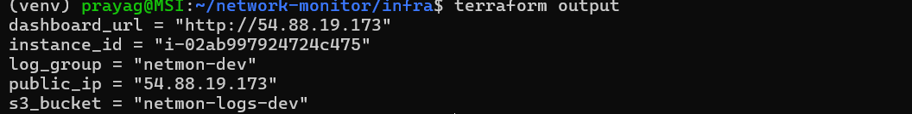
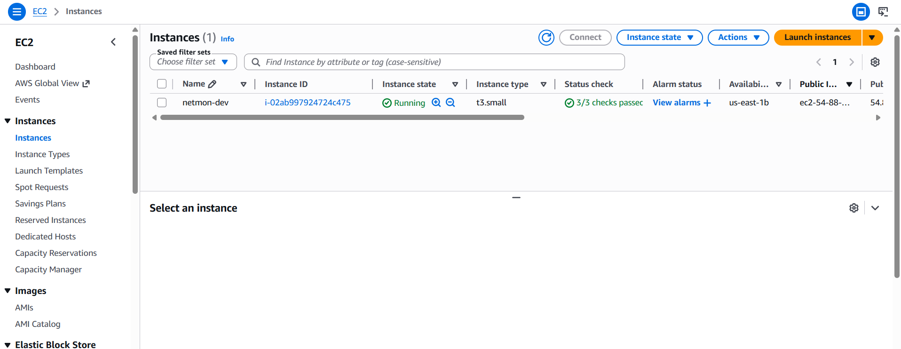
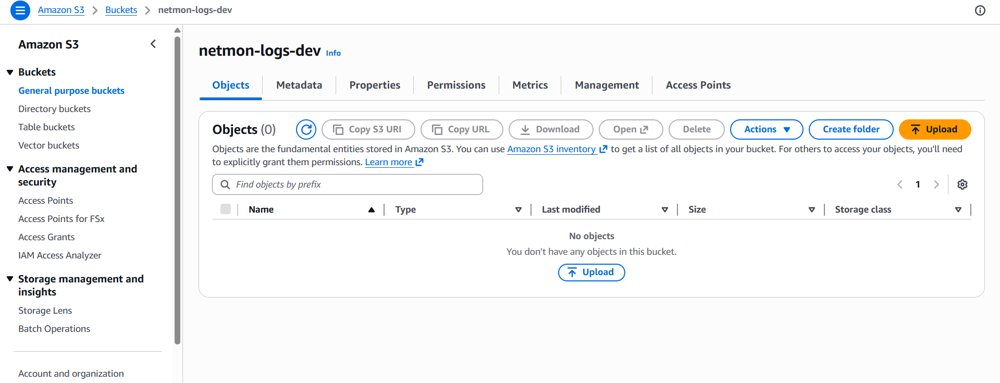

# Real-Time Network Traffic Monitor

A full-stack network monitoring dashboard that captures live packet data using Scapy, streams it over WebSockets, and visualizes traffic patterns with D3.js charts. Deployed on AWS EC2 with Terraform-provisioned infrastructure including S3 for log archival and CloudWatch for health monitoring.

## Dashboard

### Local Development


### Live on AWS


## Architecture
```
Browser (React + D3.js)
    │
    ├── WebSocket ──► FastAPI Backend ──► Scapy Packet Capture
    │                      │
    ├── REST API ──────────┘
    │
    └── Nginx reverse proxy (port 80)

AWS Infrastructure (Terraform):
    ├── EC2 (t3.small) ── Docker containers
    ├── S3 ── Log archival (Glacier at 30d, expire at 90d)
    └── CloudWatch ── CPU/status alarms, log groups
```

## Tech Stack

**Backend:** Python, FastAPI, Scapy, Prometheus, WebSockets
**Frontend:** React, TypeScript, D3.js, Vite
**Infrastructure:** Docker, Terraform, AWS (EC2, S3, CloudWatch), Nginx
**Testing:** pytest, pytest-asyncio, pytest-cov (58 tests, 92% coverage)

## Features

- Live packet capture with protocol classification (TCP, UDP, HTTP, HTTPS, DNS, ICMP, ARP)
- Real-time PPS/BPS line chart with dual Y-axes
- Protocol breakdown donut chart
- Top talkers display
- Paginated alert history
- Configurable thresholds for PPS, BPS, and connections per IP
- Prometheus metrics endpoint at /metrics
- WebSocket-driven live data feeds with 1-second polling

## Test Coverage



58 tests passed with 92% total coverage across models, API endpoints, WebSocket manager, sniffer logic, and threshold alerting.

## AWS Deployment

Infrastructure provisioned with Terraform. All resources created and destroyed via `terraform apply` and `terraform destroy`.

### Terraform Output


### EC2 Instance


### S3 Bucket (Log Archival)


### CloudWatch Alarms


## Project Structure

```
network-monitor/
├── backend/
│   ├── main.py                 # FastAPI app, WebSocket endpoint, REST API
│   ├── sniffer.py              # Scapy packet capture engine
│   ├── ws_manager.py           # WebSocket connection manager
│   ├── metrics.py              # Prometheus metrics exporter
│   ├── models.py               # Pydantic data models
│   ├── Dockerfile
│   ├── requirements.txt
│   └── tests/
│       ├── conftest.py
│       ├── test_api.py
│       ├── test_models.py
│       ├── test_sniffer.py
│       └── test_ws_manager.py
├── frontend/
│   ├── src/
│   │   ├── App.tsx
│   │   ├── main.tsx
│   │   ├── types/index.ts
│   │   ├── hooks/useWebSocket.ts
│   │   └── components/
│   │       ├── Dashboard.tsx
│   │       ├── TrafficChart.tsx
│   │       ├── ProtocolBreakdown.tsx
│   │       ├── AlertHistory.tsx
│   │       └── ThresholdConfig.tsx
│   ├── Dockerfile
│   ├── nginx.conf
│   └── package.json
├── infra/
│   ├── main.tf                 # EC2, S3, CloudWatch, IAM, Security Group
│   ├── variables.tf
│   ├── outputs.tf
│   └── terraform.tfvars.example
└── docker-compose.yml
```

## Running Locally

**Backend** (requires sudo for packet capture):

```bash
python3 -m venv venv
source venv/bin/activate
cd backend
pip install -r requirements.txt
sudo SNIFF_INTERFACE=eth0 ./venv/bin/uvicorn main:app --host 0.0.0.0 --port 8000 --reload
```

**Frontend:**

```bash
cd frontend
npm install
npm run dev
```

Open http://localhost:5173

## Running Tests

```bash
cd backend
pip install -r requirements-dev.txt
pytest --cov=. --cov-report=term-missing -v
```

## Deploying to AWS

```bash
cd infra
cp terraform.tfvars.example terraform.tfvars
# edit terraform.tfvars with your AWS values
terraform init
terraform plan
terraform apply
```

SSH into the instance and run Docker containers:

```bash
ssh -i ~/netmon-key.pem ubuntu@<PUBLIC_IP>
sudo docker compose up -d --build
```

Tear down:

```bash
terraform destroy
```
